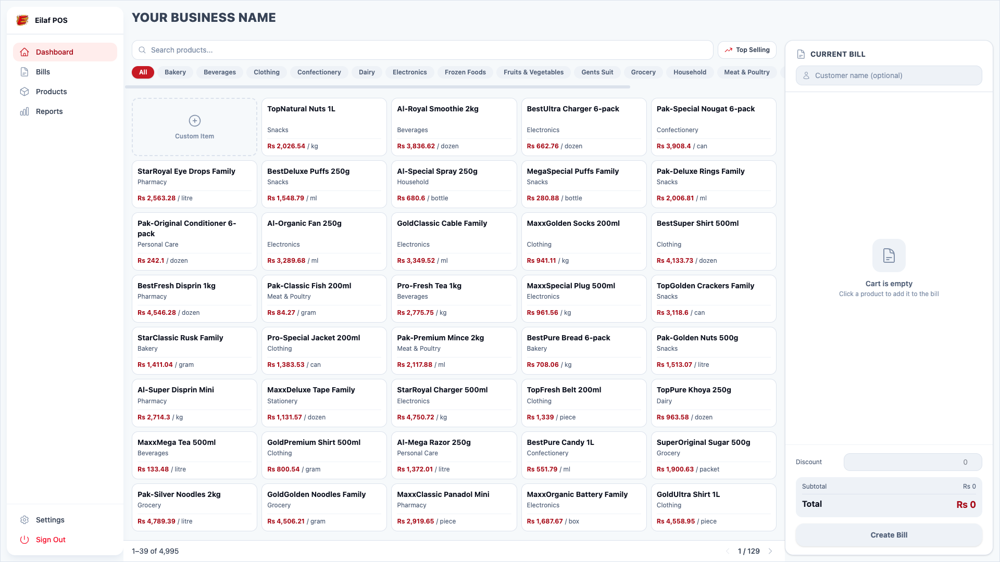
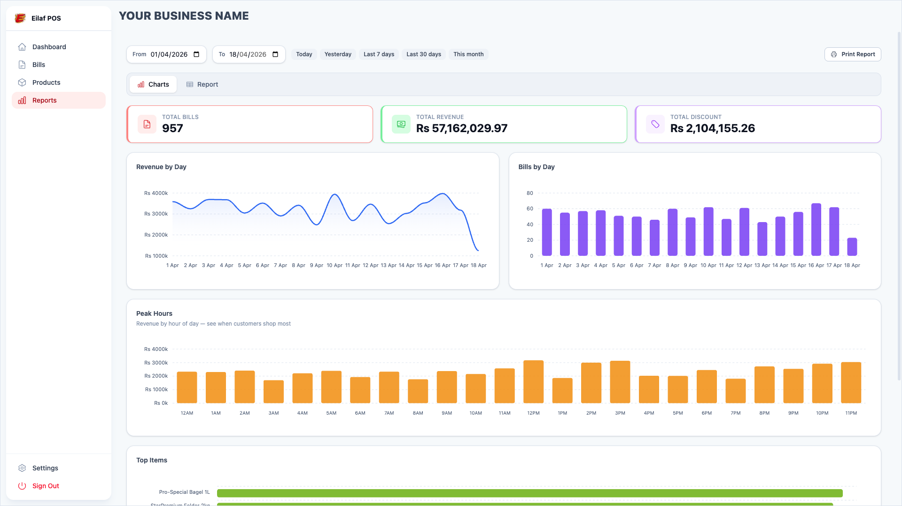
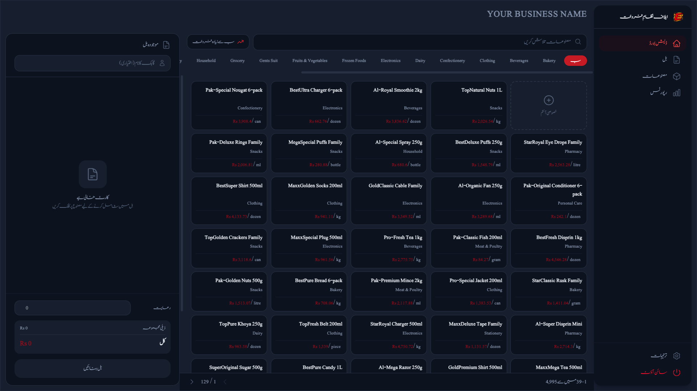
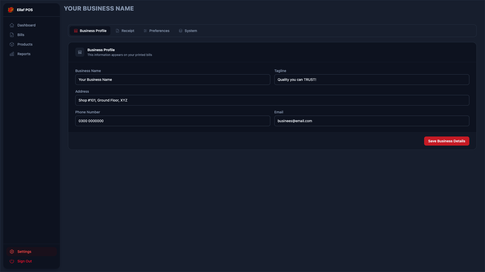
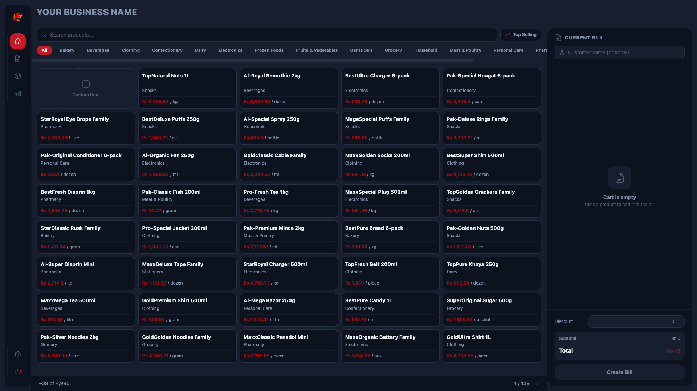
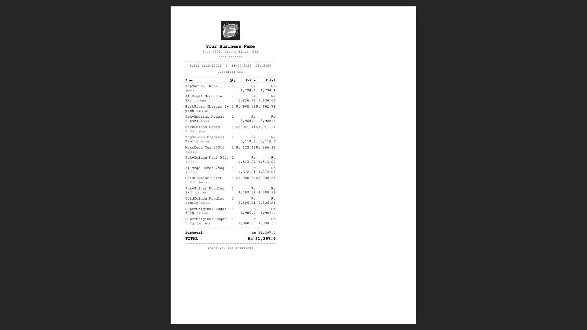

# eilaf-pos (Electron + React + SQLite)

eilaf-pos is a desktop point-of-sale application built with Electron and React.

## Screenshots

| | |
|---|---|
|  |  |
|  |  |
|  |  |

---

## Tech Stack

- Electron
- React 19 + TypeScript
- SQLite (`better-sqlite3`) for local business data
- Supabase Auth for login/session/password reset only
- React Query
- TailwindCSS
- i18next + react-i18next (Urdu / RTL)

## Architecture Standards

### 1) Data ownership

- POS business data is local-first and stored in SQLite
- SQLite access is only allowed in `src/main/db/`
- Renderer (`src/renderer/`) must never import `better-sqlite3`

### 2) Process boundary

Data flow is always:

1. Renderer pages/components
2. Hooks/services
3. Preload bridge (`window.electron.*`)
4. IPC handlers in `src/main/ipc/`
5. SQLite repositories in `src/main/db/`

### 3) Supabase policy

Supabase is restricted to authentication only:

- Sign in
- Sign out
- Session lifecycle
- Forgot/reset password

Supabase must not be used for POS business CRUD.

### 4) UI standards

- Use existing components from `src/renderer/components/`
- Do not use native `<select>` for app selects; use `SelectField`
- Use `Button`, `IconButton`, or `DropdownMenu` for actions
- Use `@heroicons/react` for icons

## Project Standards Files

- Core standards: [.instructions.md](.instructions.md)
- Agent/project context: [CLAUDE.md](CLAUDE.md)
- Skills:
  - [.github/copilot/skills/sqlite.md](.github/copilot/skills/sqlite.md)
  - [.github/copilot/skills/supabase.md](.github/copilot/skills/supabase.md)
  - [.github/copilot/skills/data-layer.md](.github/copilot/skills/data-layer.md)
  - [.github/copilot/skills/react.md](.github/copilot/skills/react.md)
  - [.github/copilot/skills/electron.md](.github/copilot/skills/electron.md)
  - [.github/copilot/skills/tailwindcss.md](.github/copilot/skills/tailwindcss.md)
  - [.github/copilot/skills/i18n.md](.github/copilot/skills/i18n.md)

## Theming

eilaf-pos uses **CSS custom property–based semantic tokens** (Tailwind 4). Theme switching toggles a class on `<html>` — no `dark:` variants appear in component files.

| File                                     | Role                                                                                 |
| ---------------------------------------- | ------------------------------------------------------------------------------------ |
| `src/renderer/styles.css`                | Defines `--color-*` variables in `@theme`; overrides them per-theme in `@layer base` |
| `src/renderer/contexts/ThemeContext.tsx` | Manages theme state in `localStorage`, applies `.dark` to `<html>`                   |

**To add a new theme** (e.g. `.sepia`): add one CSS block in `styles.css` overriding the `--color-*` variables, then add the mode to `TThemeMode` and the settings picker. No component changes needed.

**Semantic token groups:** `surface` / `surface-raised` / `surface-muted` · `edge` / `edge-strong` / `edge-muted` · `ink` / `ink-dim` / `ink-faint` / `ink-ghost` · `focus-ring` · `stat-*` accent tokens per StatCard color variant.

Full token reference: [`.github/copilot/skills/tailwindcss.md`](.github/copilot/skills/tailwindcss.md)

## Internationalization (i18n)

eilaf-pos supports multiple languages via **i18next** + **react-i18next**.

| Locale | Language | Script   | Direction |
| ------ | -------- | -------- | --------- |
| `en`   | English  | Latin    | LTR       |
| `ur`   | Urdu     | Nastaliq | RTL       |

**Font:** Urdu uses **Jameel Noori Nastaleeq Kasheeda**, bundled at `assets/fonts/`. No internet connection required.

**How it works:**

- `LocaleProvider` (`src/renderer/contexts/LocaleContext.tsx`) sets `<html dir>` and `<html lang>` on every locale change.
- The active locale is persisted in `localStorage` under the key `"locale"`.
- RTL layout uses Tailwind **logical properties** (`ms-*`, `me-*`, `border-s`, `border-e`, `text-start`) — never physical (`ml-*`, `mr-*`, `text-left`).

**Adding a new locale:** see [`.github/copilot/skills/i18n.md`](.github/copilot/skills/i18n.md) for the full step-by-step guide.

**Files:**

```text
src/renderer/
  i18n/
    index.ts              # i18next init, Locale type, LOCALES, RTL_LOCALES
    locales/
      en.json             # English strings
      ur.json             # Urdu strings
  contexts/
    LocaleContext.tsx     # LocaleProvider + useLocale hook
```

## Backup & Restore

eilaf-pos stores all business data locally in SQLite. The backup system lets you export a snapshot and restore it later — useful before major changes or when migrating to a new machine.

### How it works

- **Export** — `Settings → Backup & Restore → Export Backup`
  Opens a save dialog and writes a clean `.db` file using `better-sqlite3`'s `.backup()` method. All WAL data is flushed and merged into the file before saving, so the exported file is always consistent.

- **Restore** — `Settings → Backup & Restore → Restore Backup`
  Opens a file picker, validates the selected file is a valid SQLite database, then:
  1. Closes the active DB connection
  2. Removes any stale `-wal` / `-shm` sidecar files
  3. Copies the backup over the live DB file
  4. Relaunches the app automatically

> **Warning:** Restore replaces ALL current data (products, bills, settings). This cannot be undone.

### Implementation

| File | Role |
|---|---|
| `src/main/ipc/backup.ts` | IPC handlers for `backup:export`, `backup:selectFile`, `backup:import` |
| `src/main/db/database.ts` | `closeDb()` — safely tears down the SQLite connection before restore |
| `src/renderer/pages/settings/index.tsx` | Backup & Restore settings tab UI |

---

## Update Channels

eilaf-pos supports two update channels. Users can switch channels in `Settings → Updates`.

| Channel | Description |
|---|---|
| **Stable** | Tested releases. Recommended for daily use. |
| **Beta** | New features released earlier. May contain bugs. |

The selected channel is persisted in the `app_settings` SQLite table under the key `update_channel`. On startup, `applyStoredChannel()` reads this value and sets `autoUpdater.channel` before the first update check runs.

### Implementation

| File | Role |
|---|---|
| `src/main/ipc/updater.ts` | IPC handlers for `updater:getChannel`, `updater:setChannel`, `updater:checkForUpdates`, `updater:getVersion` |
| `src/renderer/pages/settings/index.tsx` | Updates settings tab UI — channel picker + manual update check |

---

## Scripts

```bash
pnpm start
pnpm run build
pnpm run test
```

## Seed dummy data

Inserts 5 000 products and 1 000 bills directly into the SQLite database.

> **Prerequisite:** launch the app at least once so it creates the database file.

```bash
python3 scripts/seed.py
```

The script resolves the DB path in this order:

1. `SQL_DB_PATH` environment variable (set this if the default doesn't match your machine)
2. Falls back to `~/Library/Application Support/eilaf-pos/eilaf-pos.db`

```bash
SQL_DB_PATH="/path/to/eilaf-pos.db" python3 scripts/seed.py
```

Re-run the command to add another batch of data.

To wipe all seeded data:

```bash
python3 scripts/truncate.py
# prompts for confirmation before deleting
SQL_DB_PATH="/path/to/eilaf-pos.db" python3 scripts/truncate.py
```

## Notes

- Keep business persistence in SQLite repositories and IPC.
- Keep Supabase logic isolated to auth-related hooks/contexts.
- Follow folder-based page routing and shared UI component usage.
